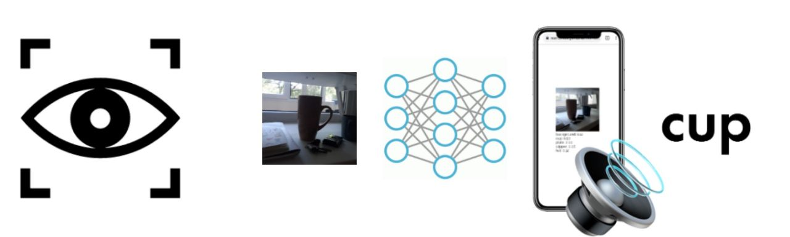

# Orama Visual Assistant

App for visually impaired people that announces objects detected using your phone camera.

## What's this about

**Orama** (from Greek: *Όραμα*, meaning *"vision"*) is a PWA that uses on-device machine learning to detect and announce objects in real time. It runs object detection with SSD MobileNetv2 via TensorFlow.js and includes OCR through Tesseract.js.

Our goal is to help visually impaired people become more independent.

## How to launch

Open `index.html` in a browser, or visit the [live demo](https://nomomon.github.io/OramaVA/).

Works best on mobile — the app uses your phone camera.

## Timeline

- **Nov 2019** — Started brainstorming ideas
- **Dec 2019** — First demo using KNN on images
- **Apr 2020** — MobileNetv2 classification via Teachable Machine
- **May 2020** — 3rd place at HackDay 2020, first project funding
- **Jul 2020** — Asia-continent finalists at [Technovation Families](https://www.curiositymachine.org/about/)
- **Jan 2022** — Switched from classification to object detection (SSD MobileNetv2). Added OCR with Tesseract
- **Mar 2022** — Started React Native rewrite

## Story

We're the Nurmukhambetov family — three brothers built this project. Our youngest sister Sofia was born prematurely. After 12 operations, doctors saved her light perception, but she still needs help to live independently. That's what drove us to build Orama.

> "Our youngest daughter, Sofia, drove us to create this project. From birth we fought for her life, they tried as much as possible to save her eyesight. In consequence of 12 operations, we were able to save Sofia's light perception. But this is not enough, in order to live a full-fledged life on her own, she needs outside help."
>
> — Damira Nurmukhambetova

[Pitch video on YouTube](https://www.youtube.com/watch?v=a6ABuAaqgfA)
